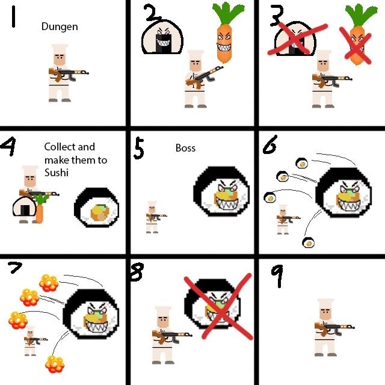

# Sushi-Challenge

-------------------

The player is a sushi chef who are trapped in a dungeon by a Evil Sushi. That Evil Sushi doesn't want to be food anymore.

Food (cucumber, carrot, rice, salmon, etc.) begin attacking him. The sushi chef need to defeat different food and collect them to make them to a sushi (points)

Finally, the sushi chef need to defeat the Evil Sushi boss and collect a amount of sushi to run away.

- [ ] **AI:** 
  - [ ] **finite state machine (like patrol, chase, attack) reference: https://learn.unity.com/tutorial/pluggable-ai-with-scriptable-objects#5c7f8528edbc2a002053b48a**
  - [ ]  **(A*) if we have time**
- [ ] **Start/Finish screens:**
  - [ ] **start screen that starts the game following player input and add a finish ("Game Over") screen that plays when the player dies**
- [ ] **In-play UI:**
  - [ ] **Pause menu**
  - [ ] **Heads up UI to display score and health points**
- [ ] 2D assets:
  - [ ] Tilesets
  - [ ] Sprite Animation
- [ ] Player controller:
  - [ ] wasd move around
  - [ ] Fire bullets towards mouse pointer position with mouse click
- [ ] Enemies
- [ ] Evil Sushi Boss

Assets example:

|  |      |      |
| :-------------------------------------------: | ---- | ---- |

Reference:

https://opengameart.org/content/customizable-character-pack

https://opengameart.org/content/lots-of-free-2d-tiles-and-sprites-by-hyptosis

https://pixelfrog-assets.itch.io/kings-and-pigs
